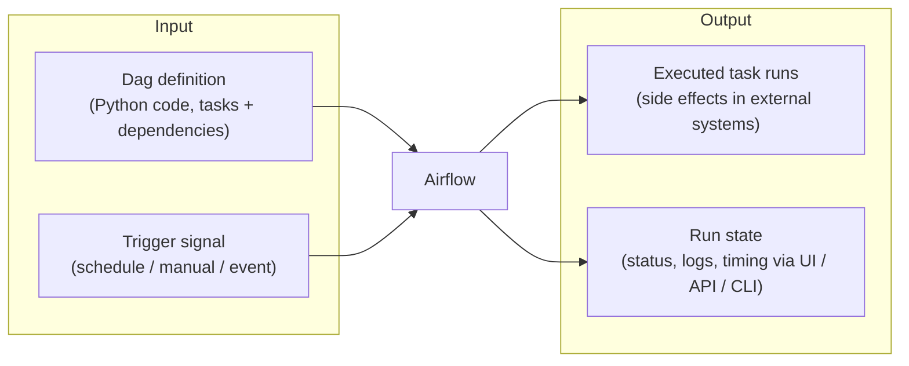

<!--
 Licensed to the Apache Software Foundation (ASF) under one
 or more contributor license agreements.  See the NOTICE file
 distributed with this work for additional information
 regarding copyright ownership.  The ASF licenses this file
 to you under the Apache License, Version 2.0 (the
 "License"); you may not use this file except in compliance
 with the License.  You may obtain a copy of the License at

   http://www.apache.org/licenses/LICENSE-2.0

 Unless required by applicable law or agreed to in writing,
 software distributed under the License is distributed on an
 "AS IS" BASIS, WITHOUT WARRANTIES OR CONDITIONS OF ANY
 KIND, either express or implied.  See the License for the
 specific language governing permissions and limitations
 under the License.
 -->

# Airflow as a Black Box

At the highest level of abstraction, ignore every internal component (scheduler,
executor, workers, metadata DB, API server) and just look at what goes in and what
comes out.

- **Primary input**: a **Dag** (Python code authored with `airflow.sdk` declaring tasks
  and dependencies) plus a **trigger signal** (a schedule interval, a manual trigger, or
  an asset/event-driven trigger) telling Airflow when to run it.
- **Primary output**: **executed task runs** — the real side effects performed against
  external systems — plus the observable **run state** (success/failed/retry, logs,
  timing) exposed via the UI, REST API, and CLI.

