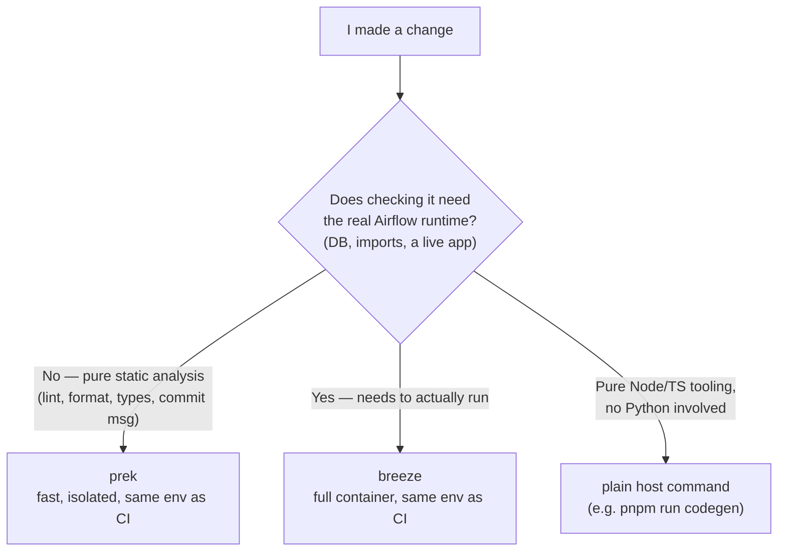

<!--
 Licensed to the Apache Software Foundation (ASF) under one
 or more contributor license agreements.  See the NOTICE file
 distributed with this work for additional information
 regarding copyright ownership.  The ASF licenses this file
 to you under the Apache License, Version 2.0 (the
 "License"); you may not use this file except in compliance
 with the License.  You may obtain a copy of the License at

   http://www.apache.org/licenses/LICENSE-2.0

 Unless required by applicable law or agreed to in writing,
 software distributed under the License is distributed on an
 "AS IS" BASIS, WITHOUT WARRANTIES OR CONDITIONS OF ANY
 KIND, either express or implied.  See the License for the
 specific language governing permissions and limitations
 under the License.
 -->

# Lesson 3: Breeze and prek

Both tools exist to solve the same root problem: **"works on my machine"
syndrome.** Airflow has a huge, fast-moving dependency tree (100+ providers,
multiple DB backends, a React frontend). If every contributor's laptop has
slightly different installed versions, tests pass locally and fail in CI (or
vice versa) — nothing settles that argument faster than "it works for me."

They solve it at two different layers.

## Breeze — the heavy, reproducible layer

Breeze is a Docker container that mirrors CI exactly — same Python version,
same system packages, same locked dependencies (`uv.lock`). When you run
`breeze run pytest ...`, you aren't running pytest against your host Python
at all — you're running it inside that container, so if it passes for you,
it passes in CI, full stop.

That's also why the repo's rule is **"never run pytest/python/airflow
commands directly on the host."** Your host Python doesn't have Postgres,
doesn't have the exact locked dependency versions, and isn't what CI
actually tests against.

## prek — the fast, targeted layer

prek is the opposite trade-off: instead of a full container, it runs
individual checks (ruff, mypy, license headers, commit message format,
OpenAPI spec generation) directly, each in its own tiny isolated
environment, in parallel. It's fast enough to run on every commit.
Critically, prek hooks use the **same environment CI uses**, so passing prek
locally is still a reliable predictor of passing CI — just without the
overhead of spinning up the whole container for a one-line lint check.

Some prek hooks still need the real Airflow runtime (e.g. generating the
OpenAPI spec requires introspecting a live FastAPI app). Those hooks
delegate to breeze internally for just that one step, then return control to
prek — you don't have to think about it, but it's worth knowing prek and
breeze aren't fully separate; prek can call breeze when a check genuinely
needs the container.

## The decision rule

## Mapping it back to a real example

Commands actually run while implementing the Backfills date-filter change
([issue #53049](https://github.com/apache/airflow/issues/53049), see
[lesson 2](02_backfill_filters_issue.md)):

| Command | Tool | Why that one |
|---|---|---|
| `uv run ruff format backfills.py` / `ruff check --fix` | plain `uv run` | Ruff doesn't need the full container — it's a standalone linter with its own light environment |
| `prek run generate-openapi-spec --files backfills.py` | prek (delegates to breeze internally) | Needed a real FastAPI app to introspect routes and emit the spec |
| `breeze run pytest airflow-core/tests/.../test_backfills.py` | breeze | Needs a real Python env with DB test fixtures — the "can't run without the container" case |
| `prek run mypy-airflow-core --files backfills.py` | prek | Type-checking is self-contained, no runtime needed |
| `pnpm run codegen` | neither (plain host) | Pure Node/TypeScript tooling — no Python runtime involved at all |

## The general workflow for any future change

1. Edit the code.
2. `ruff format` / `eslint --fix` for quick formatting.
3. `breeze run pytest <the specific test file>` to prove it actually works.
4. `prek run --from-ref main --stage pre-commit` for the full fast check sweep.
5. `prek run --from-ref main --stage manual` for the slower ones (mypy,
   OpenAPI spec generation) before you push.

## Quick check

If you added a new column to a SQLAlchemy model (say, a new field on
`Backfill`) and needed an Alembic migration, would generating that migration
be a prek job or a breeze job — and why?
