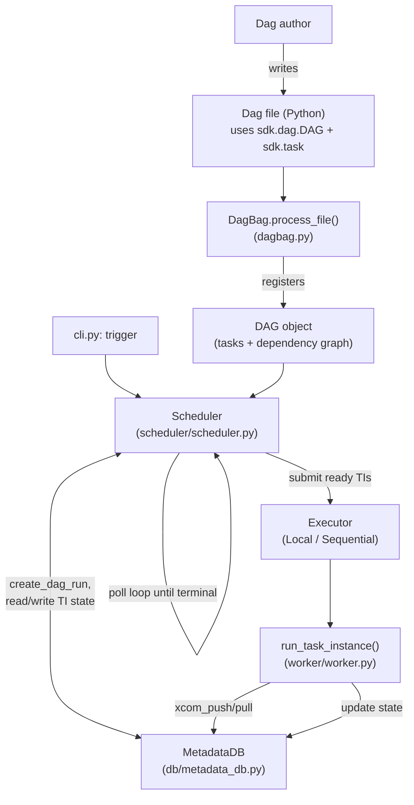

# mini_airflow: a ~1000-line model of Airflow's architecture

This is a working, runnable re-implementation of Apache Airflow's most
important components, small enough to read in one sitting (~870 lines of
Python across 24 files). It exists to build intuition for *how the real
system fits together* before you go read `airflow-core/` and `task-sdk/` at
full scale — every module below names the real file it stands in for.

It is a teaching model, not a spec. Where it simplifies something load-bearing
in real Airflow, that's called out explicitly (see "What's deliberately left
out" below) rather than silently glossed over.

## Run it

From `docs/personal_onboarding/` (one directory up from this file — that's
what makes the `mini_airflow` package importable):

```bash
# run all three example dags and assert they behave as expected
python3 run_examples.py

# or drive one dag through the CLI, same as `airflow dags test`
python3 -m mini_airflow.cli show    mini_airflow/examples/example_dag.py example_etl
python3 -m mini_airflow.cli trigger mini_airflow/examples/example_dag.py example_etl --executor local
```

No dependencies beyond the Python 3.10+ standard library.

## Map to the real codebase

| mini_airflow module | Stands in for (real Airflow) | What it demonstrates |
|---|---|---|
| `sdk/dag.py` | `airflow.sdk.DAG` (`task-sdk/`) | `with DAG(...) as dag:` context, task registry, `>>`/`<<` |
| `sdk/task.py` | `airflow.sdk.BaseOperator`, `@task`, `XComArg` | The TaskFlow API: `load(transform(extract()))` builds both dependency edges *and* the XCom data channel |
| `sdk/sensor.py` | `airflow.sdk.bases.sensor.BaseSensorOperator` | Poll-until-true tasks (simplified — see limitations) |
| `dagbag.py` | `dag_processing/dagbag.py` | The one place user Dag-file code actually executes |
| `models/state.py` | `utils/state.py` | The `TaskInstanceState`/`DagRunState` state machines |
| `models/taskinstance.py`, `models/dagrun.py` | `models/taskinstance.py`, `models/dagrun.py` | The row shapes the whole system operates on |
| `db/metadata_db.py` | The metadata database | Single source of truth; everything else reads/writes through it |
| `scheduler/scheduler.py` | `jobs/scheduler_job_runner.py` | Dependency resolution: trigger rules, retry timing, upstream-failure propagation |
| `executor/*.py` | `executors/` (Local, Sequential, Celery, K8s, …) | Pluggable *where/how* a task instance runs, decoupled from *whether* it should run |
| `worker/worker.py` | `task-sdk/.../execution_time/task_runner.py` | Executes one task instance, translates exceptions into retry/failure state |
| `cli.py` | `cli/` + `airflow dags test` | User-facing entry point |

## Architecture diagram



This is the same shape as the black-box and architecture-boundary diagrams
earlier in `docs/personal_onboarding/` and in the repo's `CLAUDE.md` — just
zoomed in far enough that every box is a file you can open and read.

## Walking through a run

`example_dag.py` defines `extract -> transform -> load` using the TaskFlow
API. Running it:

1. `DagBag.process_file()` imports the file; `with DAG(...)` registers a
   `DAG` and each `@task`-decorated call adds a `PythonOperator` plus a
   dependency edge (via `XComArg`).
2. `Scheduler.trigger_dag()` asks `MetadataDB` for a new `DagRun`, which
   creates one `TaskInstance` per task, all starting in state `NONE`.
3. `Scheduler.run_to_completion()` loops: find task instances whose upstream
   dependencies satisfy their `trigger_rule` (default `all_success`), mark
   them `QUEUED`, and hand them to the `Executor`.
4. The `Executor` (thread pool for `LocalExecutor`, synchronous for
   `SequentialExecutor`) calls `worker.run_task_instance()`, which runs the
   task's Python callable, pushes its return value to `MetadataDB` as XCom,
   and sets the instance to `SUCCESS` or (if retries remain) `UP_FOR_RETRY`
   or `FAILED`.
5. The scheduler polls again, sees `extract` succeeded, and now `transform`
   (whose only upstream is `extract`) becomes ready — and so on until every
   task instance reaches a terminal state.

`example_retry_dag.py` exercises the failure paths: `download` fails twice
and succeeds on try 3 (`retries=3`), `broken` fails permanently, and
`cleanup` (`trigger_rule="all_done"`) still runs because it doesn't require
its upstreams to have succeeded — only to have finished.

## What's deliberately left out

This project intentionally does **not** model:

- **Process/network isolation.** Real Airflow puts the Execution API between
  workers and the database specifically so a worker (running arbitrary task
  code) can't touch the metadata DB or other tasks' data. Here,
  `TaskInstanceContext` calls `MetadataDB` in-process for brevity — the
  module boundary is kept so you can see exactly where that isolation would
  go, but nothing enforces it.
- **Deferred/async waiting (the Triggerer).** `BaseSensorOperator.execute()`
  blocks its worker thread in a poll loop. Real Airflow lets a sensor
  `defer()`, handing the wait condition to the Triggerer so the worker slot
  is freed — there's no equivalent of `jobs/triggerer_job_runner.py` here.
- **Dag serialization.** Real Airflow's scheduler never imports user code —
  it reads a serialized representation from the DB
  (`models/serialized_dag.py`). Here, `Scheduler` holds a live `DAG` object
  with real Python callables, so nothing demonstrates why serialization
  matters for the "scheduler never runs user code" security boundary.
- **Persistence.** `MetadataDB` is an in-memory dict; state doesn't survive
  a process restart, so there's no equivalent of Alembic migrations or
  recovering in-flight dag runs after a crash.
- **Multiple concurrent dag runs, backfills, pools, SLAs, callbacks,
  connections/variables, and the REST API / UI.** All out of scope — the
  goal was the smallest system that still has a real scheduler loop, a real
  executor abstraction, and a real dependency/retry state machine.

For all of the above, `CLAUDE.md` (repo root) and
`airflow-core/docs/security/security_model.rst` are the authoritative
references.
